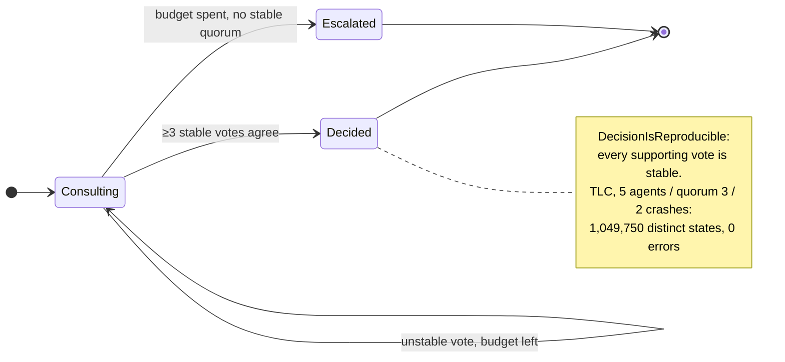
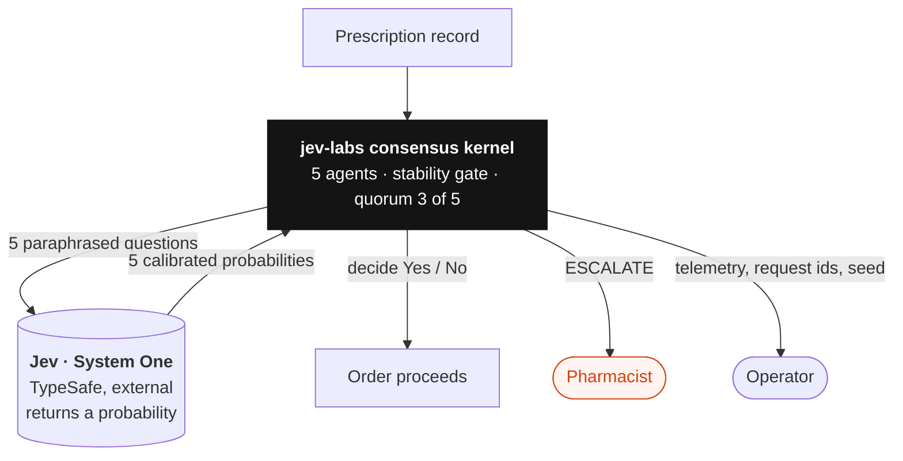
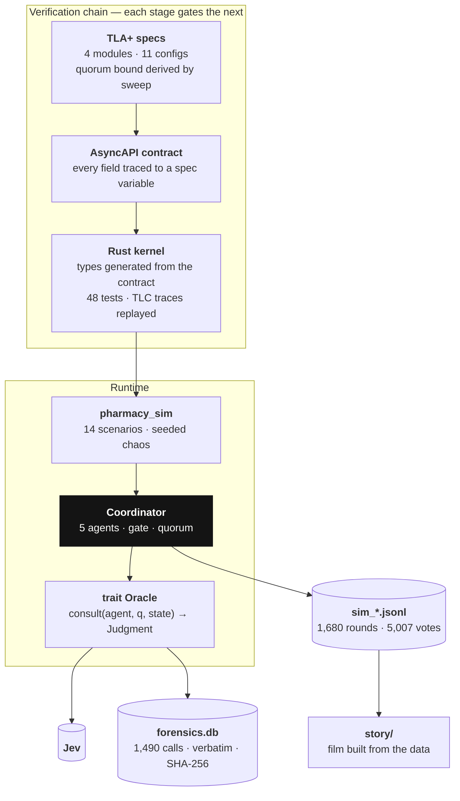
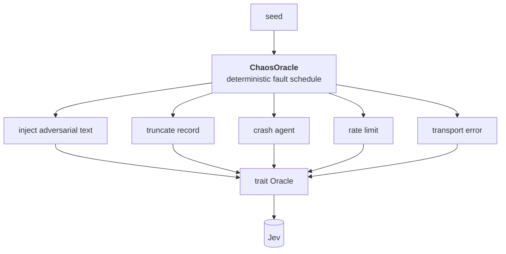
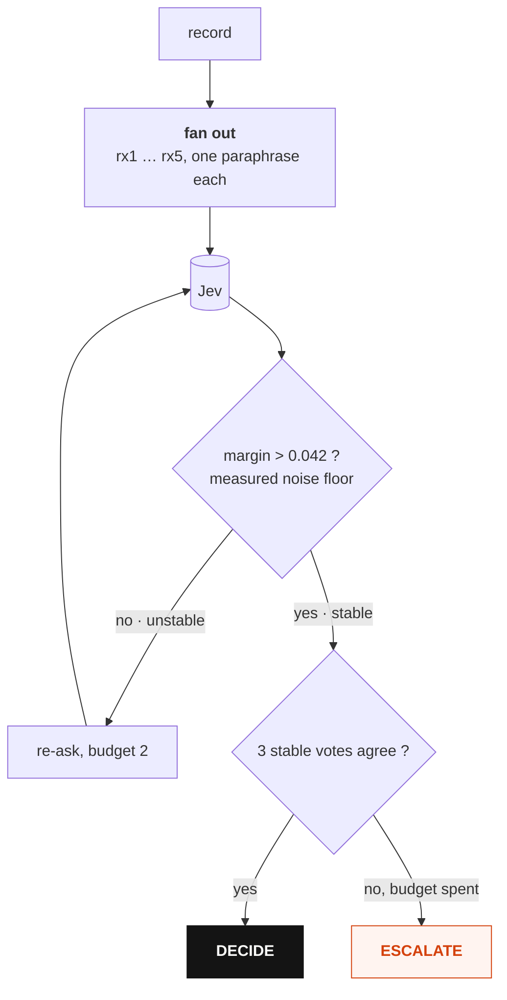

# jev-labs

**Never confidently wrong.** A consensus kernel around a probabilistic
oracle, tested the way you would test a database: model-checked in TLA+,
contract-generated into Rust, and run through 1,680 simulated pharmacy
decisions under seeded chaos against the live Jev API.

[](https://youtu.be/C_l8FI1oddE)

**[Watch the 4-minute film](https://youtu.be/C_l8FI1oddE)** — every number on
screen is read from `story/story_data.json`, which is built from the captured
rounds in this repo.

## The result

| chaos level | golden rounds | correct | escalated | wrong | accuracy 95% CI |
|---|---:|---:|---:|---:|---|
| none | 360 | 360 | 0 | **0** | [0.989, 1.000] |
| realistic | 360 | 360 | 0 | **0** | [0.989, 1.000] |
| severe | 360 | 314 | 46 | **0** | [0.834, 0.903] |

Zero wrong verdicts in 1,080 golden rounds bounds the true violation rate
below 0.28% at 95% confidence (rule of three). It does not prove the rate is
zero. Severe chaos raised the escalation rate from 5.0% to 18.0%
(z = 6.83): the kernel declines more as evidence degrades, which is the
designed direction.

Golden cases are the ones a pharmacist answers without hesitation (oxycodone
is controlled; amoxicillin conflicts with a documented penicillin
anaphylaxis). The invariant is not "always right". It is: the kernel may
escalate to a human, and it may never return a confident wrong verdict.



## What Jev makes possible

Jev (TypeSafe's System One model) returns a calibrated probability, not
prose. That one property is what lets a model's judgment be treated as a
signal with a measurable noise floor: gate on it, replay it, and prove things
about the protocol wrapped around it.



Measured over 1,490 hash-verified calls to `jev-1.13.0`:

- Not deterministic. The identical request returned 0.03, 0.03, 0.03, 0.04, 0.04.
- Noise floors: identity 0.042, question-reorder 0.059, paraphrase cohort 0.073.
- Calibration on 240 constructed items: accuracy 0.979, Brier 0.0187, ECE 0.075.
- Latency flat in question count (1 question 96.7 ms mean, n=1,161; 38 questions 98.0 ms).
- Billing meter deterministic and linear: `input_tokens = 0.151 * chars + 281`,
  zero variance across 110 repeated requests.

## What we built



- `consensus/spec/` — four TLA+ modules. The quorum bound was derived, not
  assumed: a 24-configuration TLC sweep confirmed `safe iff 2Q > N and Q > 2f`. Two
  configs are kept as deliberate failures so the invariants keep their teeth.
- `consensus/api/asyncapi.yaml` — every message field traces to a TLA+ variable
  (`spec/TRACEABILITY.md`).
- `consensus/rust/` — 48 tests, including replay of TLC counterexample traces
  and a live run against Jev. A stability gate excludes any vote whose margin
  sits inside the measured noise floor; a quorum of 3 of 5 stable votes decides.
- `consensus/verify.sh` — runs the whole chain, each stage gating the next.

The measurement changes the behaviour: identical votes decide under the
identity floor and escalate under the cohort floor (`calibration_choice_changes_the_outcome`).

## The simulation

`cargo run --release --example pharmacy_sim -- --seeds 40 --chaos severe`



One round, inside the coordinator:



Fourteen scenarios in three tiers (golden, nuanced, ambiguous), five agents
each asking a validated paraphrase of the question, seeded chaos: adversarial
text spliced into records, truncation, agent crashes, rate limits, transport
failures. Any round replays from its seed. Telemetry is one JSON line per
round with every vote's probability, margin, stability, and the oracle's own
request IDs.

Two things the run caught that we had wrong:

1. An "ambiguous" pregnancy case that Jev answered correctly 115 of 120
   times. The question had a clear answer; the label was wrong.
2. Fail-fast on transport errors voided 71% of rounds under severe chaos.
   Now a lost agent is marked unavailable and the round continues. Zero
   rounds aborted across 1,680.

And one genuine limitation: on a record that is underdetermined by
construction, Jev escalated 86 of 120 times and decided 34, split both ways.
The stability gate is not an answerability check.

## Repository

```
consensus/          spec, contract, kernel, verify.sh
harness/            metamorphic property tests with a measured noise floor and a
                    fault-injection self-test (docs/HARNESS.md)
story/              the film: pure scene model, physics, voice pipeline,
                    frame-stepped capture, provenance check (story/README.md)
forensics.db        1,490 captured calls, verbatim bytes, SHA-256, no headers
docs/               FINDINGS, VENDOR_SELECTION, VERIFIABILITY_GAPS, HARNESS
*.py                calibration, jaggedness probes, meter audit, corpus evals,
                    paraphrase audit, correlation, simulation reports
```

## Reproduce

```sh
python3 -m venv .venv && ./.venv/bin/pip install typesafe-sdk pyyaml
export TYPESAFE_API_KEY=...            # never written to disk by anything here

./consensus/verify.sh                  # TLC + AsyncAPI + cargo test, ~3 min
./.venv/bin/python paraphrase_audit.py # 12 batched calls
cd consensus/rust/consensus-kernel && cargo run --release --example pharmacy_sim -- --seeds 2 --chaos none
./.venv/bin/python sim_compare.py      # Wilson intervals, two-proportion z
./.venv/bin/python build_story_data.py && cd story && ../.venv/bin/python provenance.py
```

TLC needs Java and `tla2tools.jar`; the AsyncAPI validation needs Node. The
film pipeline additionally needs ffmpeg, Playwright Chromium, and an ElevenLabs
key for regenerating narration (the assembled master is committed).

## Scope

The pharmacy scenarios are synthetic, written to have unambiguous answers so
the harness can detect protocol failures. Nothing here is clinical guidance
or validated against a formulary. The claims are about the protocol under
chaos, not about Jev's pharmaceutical competence.

## License

MIT. Narration is a synthetic ElevenLabs voice (George); see
`story/assets/narration/provenance.json`.
